# TOPIC 6:
## Cài AAPanel lên VPS:
- Cập nhật hệ thống và cài AAPanel:
    ```
    sudo apt update && sudo apt upgrade -y
    
    wget -O install.sh http://www.aapanel.com/script/install-ubuntu_6.0_en.sh
    sudo bash install.sh

    ```
    
- Sau khi cài xong màn hình sẽ hiển thị đường dẫn và thông tin để đăng nhập vào AAPanel:
    
   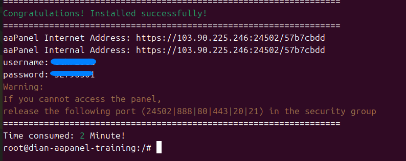

- Truy cập vào đường dẫn sẽ hiện thi ra trang đăng nhập:

   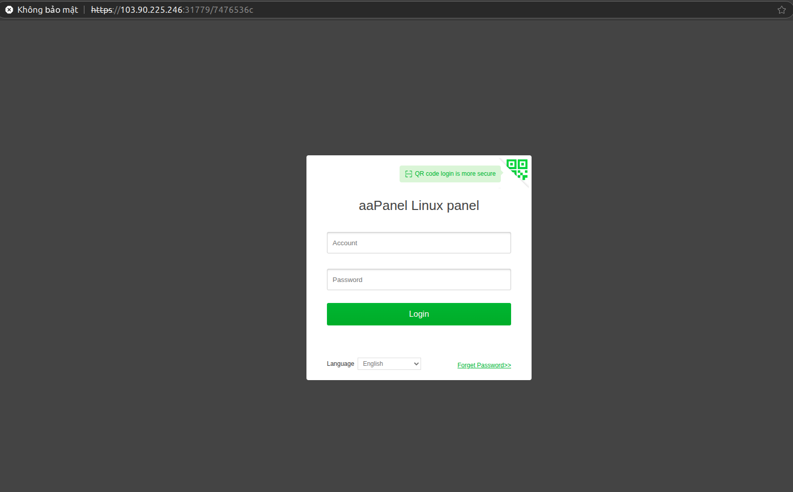

   
- Đăng nhập và tải các gói cần thiết


   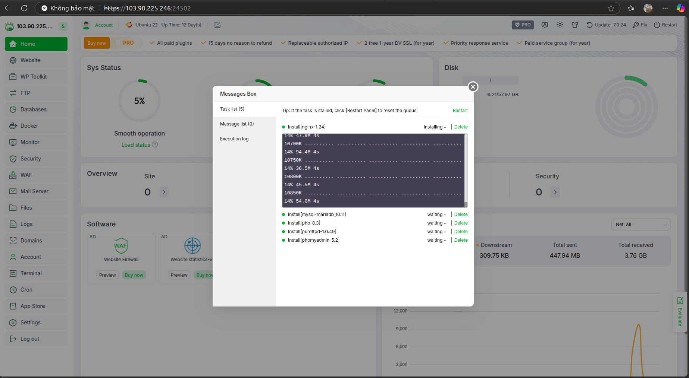
## Tạo website wordpress trên AAPanel
- Add site và Upload source code:


   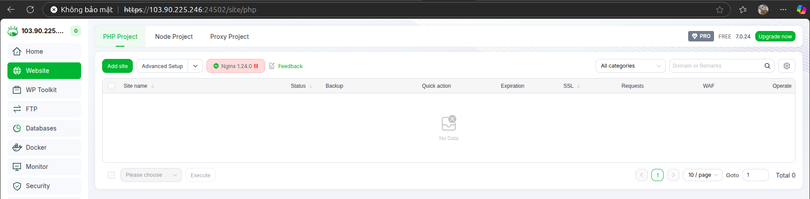
- Điền các thông tin cần thiết:
  
   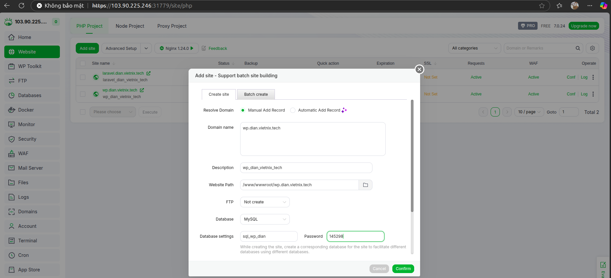

- Upload source code: 
   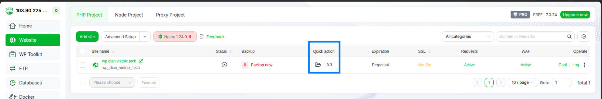
   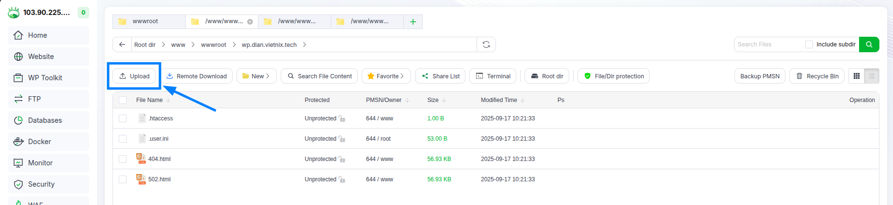
   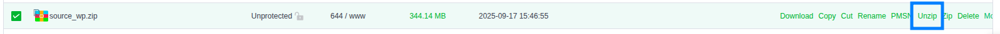
  - Xóa file index mặc định.
   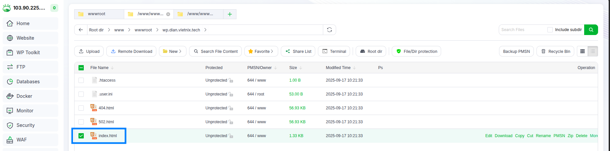
- Cài SSL cho domain:
  - Nhập các thông tin cần thiết:
   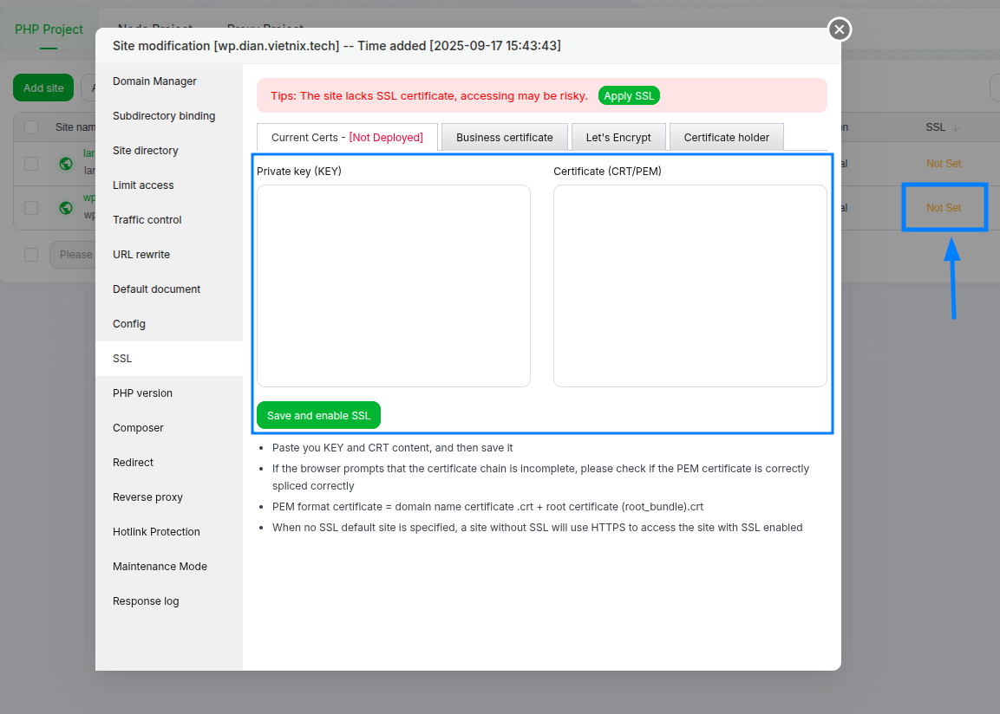
   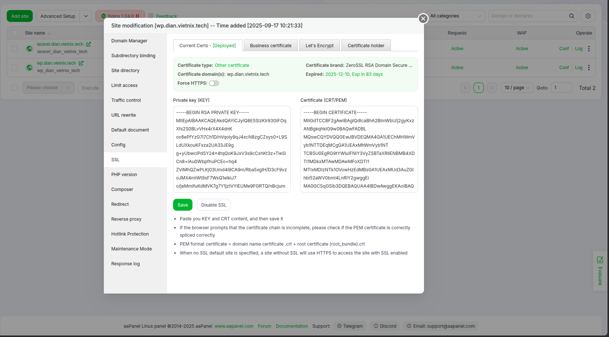
- Cấu hình lại file config và .env cho 2 website:
  - .env:
    
    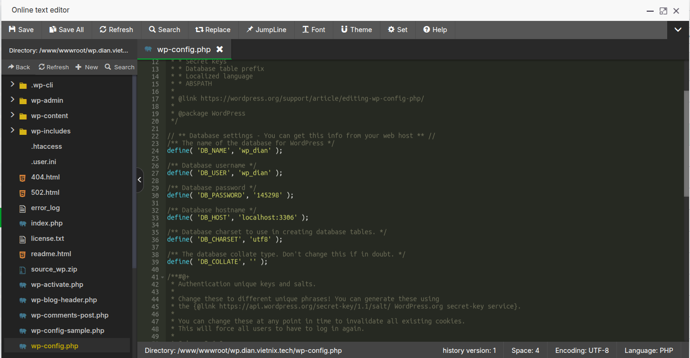
