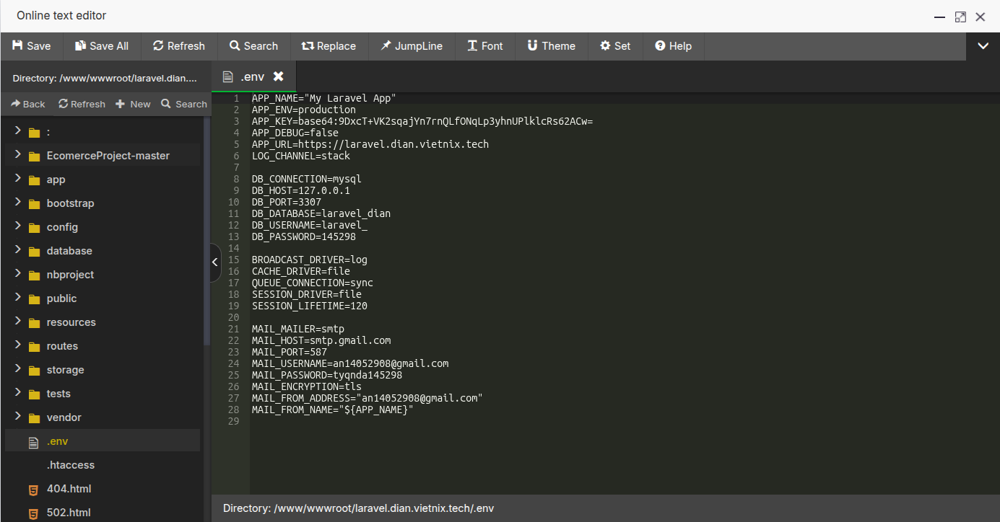

# TOPIC 6:
## Cài AAPanel lên VPS:
- Cập nhật hệ thống và cài AAPanel:
    ```
    sudo apt update && sudo apt upgrade -y
    
    wget -O install.sh http://www.aapanel.com/script/install-ubuntu_6.0_en.sh
    sudo bash install.sh

    ```
    
- Sau khi cài xong màn hình sẽ hiển thị đường dẫn và thông tin để đăng nhập vào AAPanel:
    
   

- Truy cập vào đường dẫn sẽ hiện thi ra trang đăng nhập:

   

   
- Đăng nhập và tải các gói cần thiết


   
## Tạo website wordpress trên AAPanel
- Add site và Upload source code:


   
- Điền các thông tin cần thiết:
  
   

- Upload source code: 
   
   
   
  - Xóa file index mặc định.
   
- Cài SSL cho domain:
  - Nhập các thông tin cần thiết:
   
   
- Cấu hình lại file config và .env cho 2 website:
  - .env:
    
    
## Cài đặt và active các Plugin: 
- Truy cập và đăng nhập vào trang Wordpress: https://wp.dian.vietnix.tech/wp-admin/
- Cài đặt plugin đã tải về trên máy:
   
   
  - Sau khi upload các plugin lên thì active chúng:
    
## WP-Optimize - Cache và LiteSpeed Cache
- WP-Optimize – Cache
        
    
    - Mục đích chính
        - Tối ưu và dọn dẹp cơ sở dữ liệu WordPress (xóa bản revision, spam, transient…).
        - Tích hợp bộ nhớ đệm (page cache) mức cơ bản
        - Tối ưu ảnh (compress/resize).
    
    
    - Khi nào nên cài
        - Website chạy trên bất kỳ loại web server nào (Apache, Nginx, LiteSpeed…).
        - Cần công cụ all-in-one nhẹ: dọn dẹp database + cache + nén ảnh.
        - Hosting không hỗ trợ LiteSpeed (ví dụ server Nginx/Apache thông thường).
        - Bạn muốn giải pháp đơn giản, không phụ thuộc cấu hình máy chủ.


- LiteSpeed Cache
        

  
    - Mục đích chính
        - Tận dụng server-level cache (LSCache) của máy chủ OpenLiteSpeed hoặc LiteSpeed Enterprise.
        - Hỗ trợ ESI (Edge Side Includes), cache động cho các phần khác nhau của trang (ví dụ giỏ hàng WooCommerce).
        - Tích hợp CDN, nén ảnh, tối ưu CSS/JS, lazy load, object cache (Memcached/Redis).
    
    
    - Khi nào nên cài
        - Hosting/VPS của bạn chạy LiteSpeed hoặc OpenLiteSpeed (kiểm tra với nhà cung cấp).
        - Muốn hiệu năng cao nhất, đặc biệt cho:
        - Website thương mại điện tử (WooCommerce).
        - Trang tin lớn, nhiều khách truy cập.
        - Website cần full-page cache ở cấp máy chủ.
        - Khi đã kích hoạt LSCache module trên server (nếu dùng aaPanel + OpenLiteSpeed, chỉ cần bật module).
