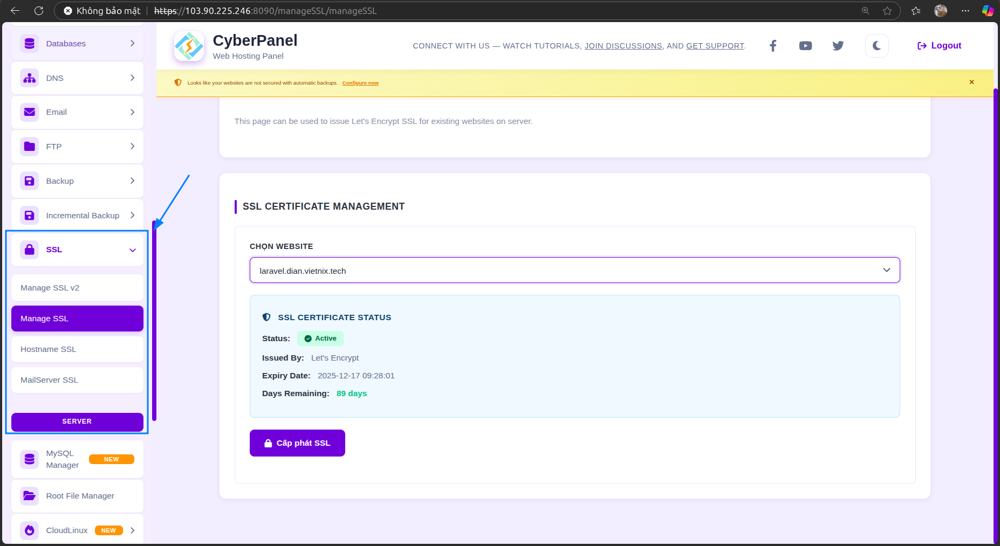

# TOPIC 7
## Cài đặt Cyber Panel:
  - Cài đặt Cyber Panel :
    ```
    sh <(curl https://cyberpanel.net/install.sh || wget - O - https://cyberpanel.net/install.sh)
    ```
  - Sau khi caì đặt, đường dẫn và thông tin đăng nhập của CyberPanel sẽ hiển thị trên màn hình:


  - Truy cập đường dẫn và đăng nhập vào CyberPanel
    

    
  - Tạo website và Upload source code:
    
    
    
    

    
  - Tạo và thêm database vào website

   
    

    
  - Cài SSL:

   
    

    
  - Chỉnh sửa file wp.config.php và .env

   
    

    
    

    
  - Trỏ đường dẫn thư mục của laravel đến /public :

    
    
## Proxy pass
  - Tạo tài khoản và mật khẩu OpenLiteSpeed
    ```
      cd  /usr/local/lsws/admin/misc/admpass.sh
    ```
    
  - Truy cập OpenLiteSpeed: https:/<IP_VPS>/7080 và đăng nhập
    
    
  - Tạo app proxy trên port 5000:
    
    


    - Tạo app flask cơ bản:
      ```
      python3 -m venv venv
      source venv/bin/activate
      pip install flask
      ```
    - Tạo file app.py
      ```
      nano app.py
      ```
      Copy nội dung file
      ```
        from flask import Flask

        app = Flask(__name__)
        
        @app.route("/")
        def hello():
            return "Hello Flask on port 5000!"
        
        if __name__ == "__main__":
            # 0.0.0.0 để lắng nghe mọi IP
            app.run(host="0.0.0.0", port=5000, debug=True)

       ```
      - Chạy app và truy cập vào http://<server_ip>:5000 :
        ```
        python app.py
        ```
        
