# TOPIC 8
## VestaCP

### Cài đặt VestaCP
- Truy cập vào trang chủ vestaCP: https://vestacp.com/ và chọn Install
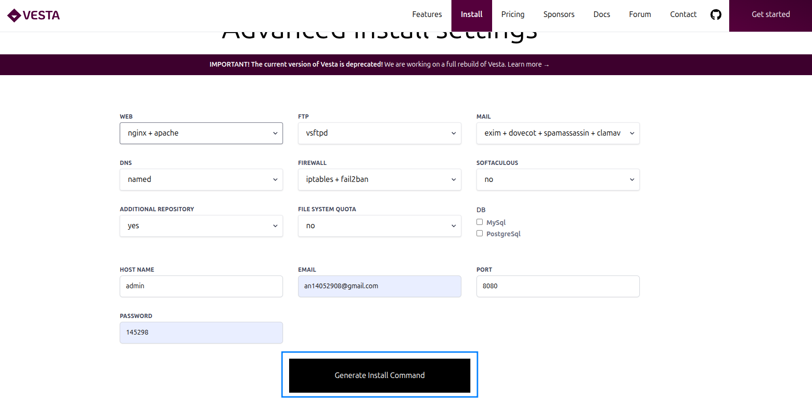
- Nhập các thông tin cần cho website của bạn, sẽ xuất hiện hướng dẫn cài đặt VestaCP:
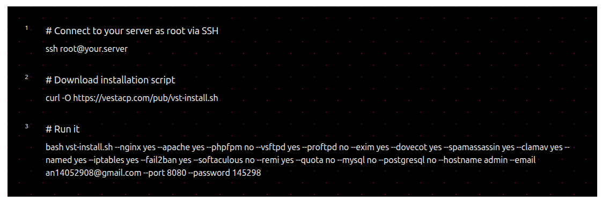
- Sau khi cài đặt thành công sẽ hiện thông tin tài khoản và mật khẩu để đăng nhập

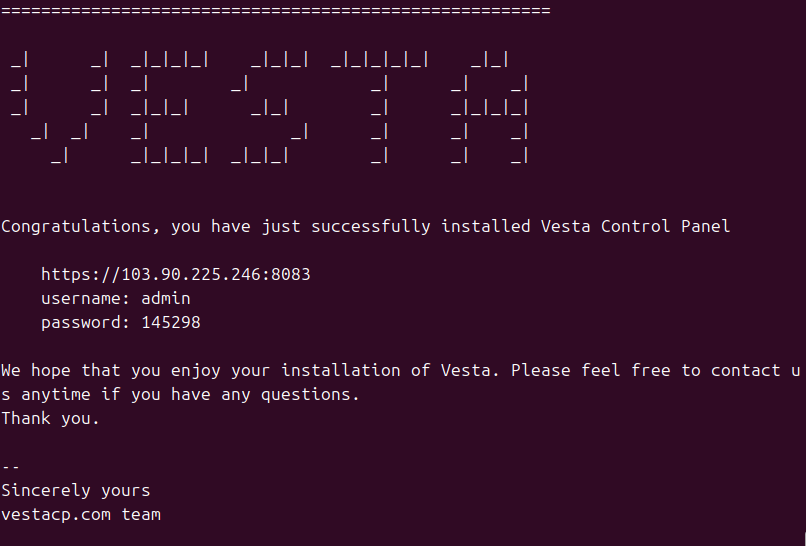

- Truy cập vào đường dẫn và đăng nhập bằng tài khoản vừa được tạo sau khi cài đặt.
- Tạo domain mới và nhập các thông tin cần thiết:
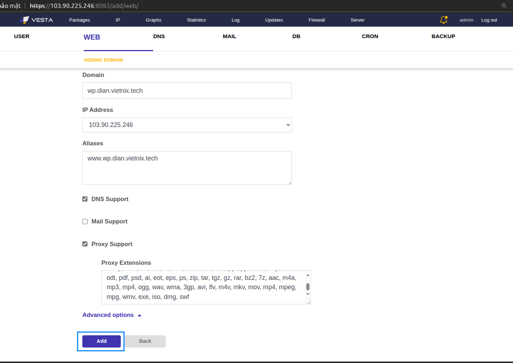
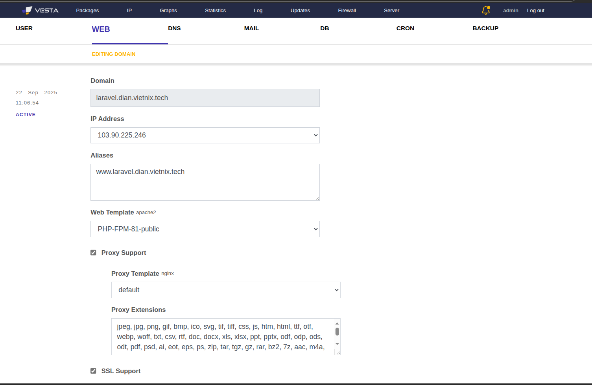

- Nhập SSL:

  
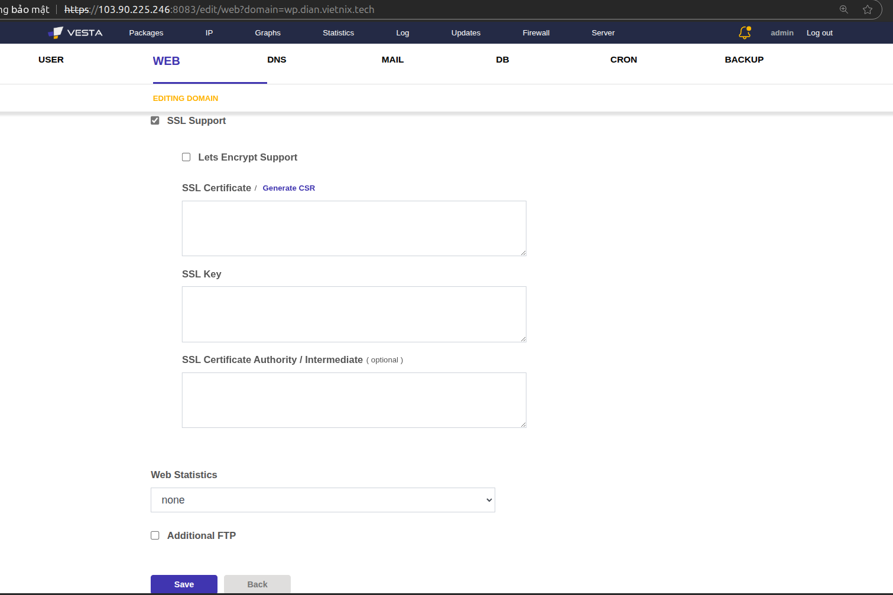
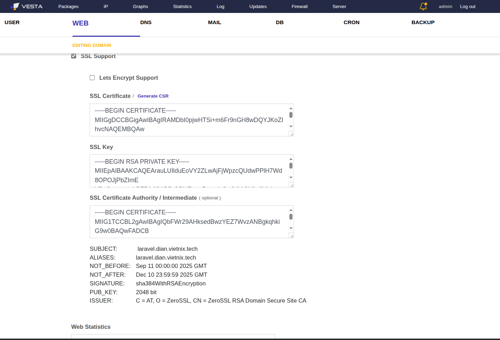

- Tạo Database và upload file .sql
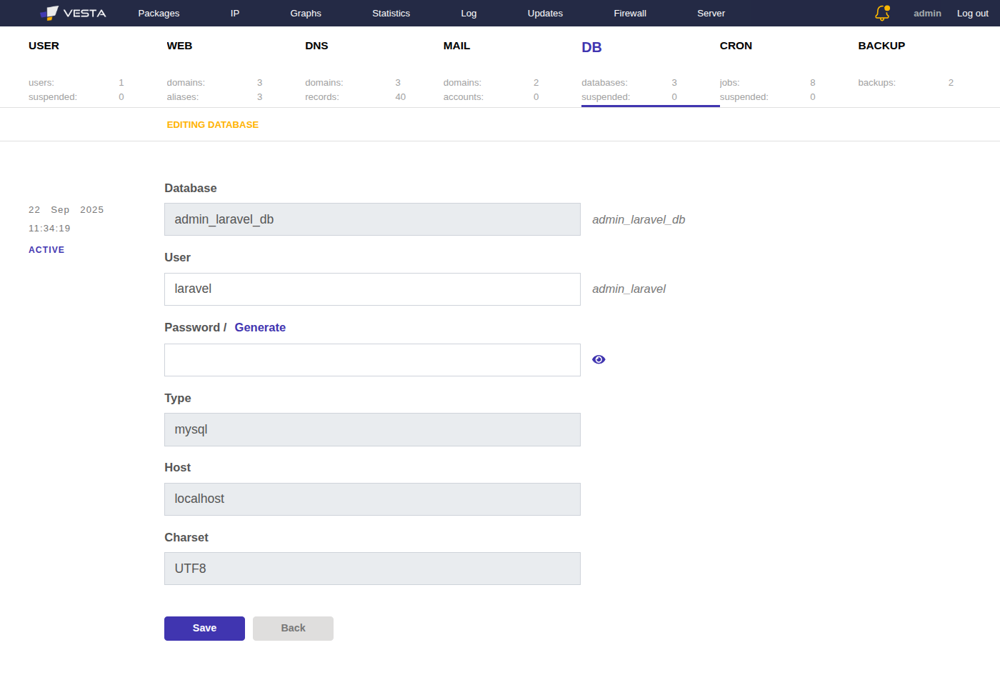
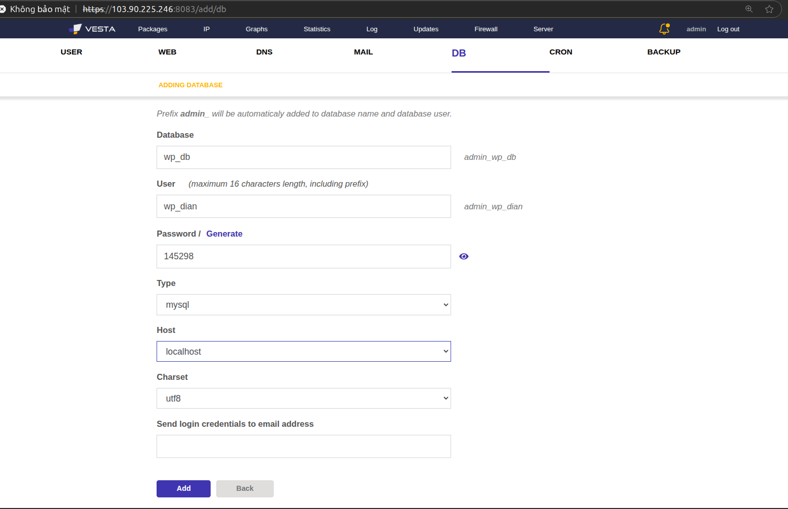
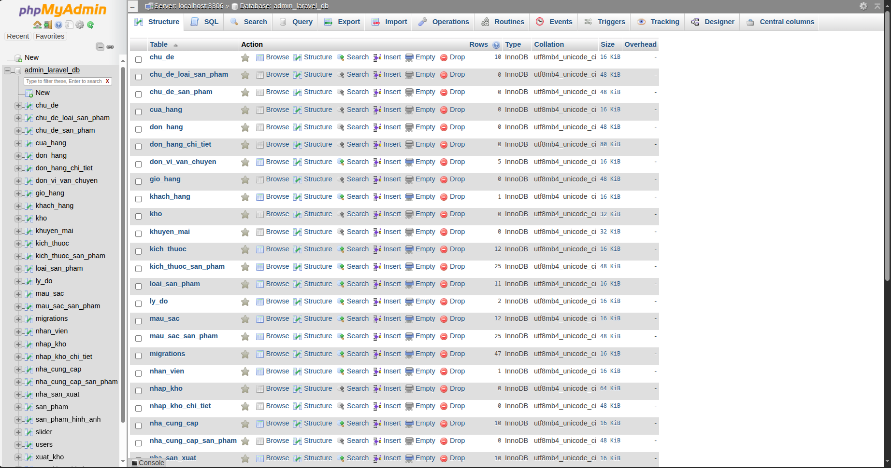
  
- Upload Source code: sử dụng FileZilla 

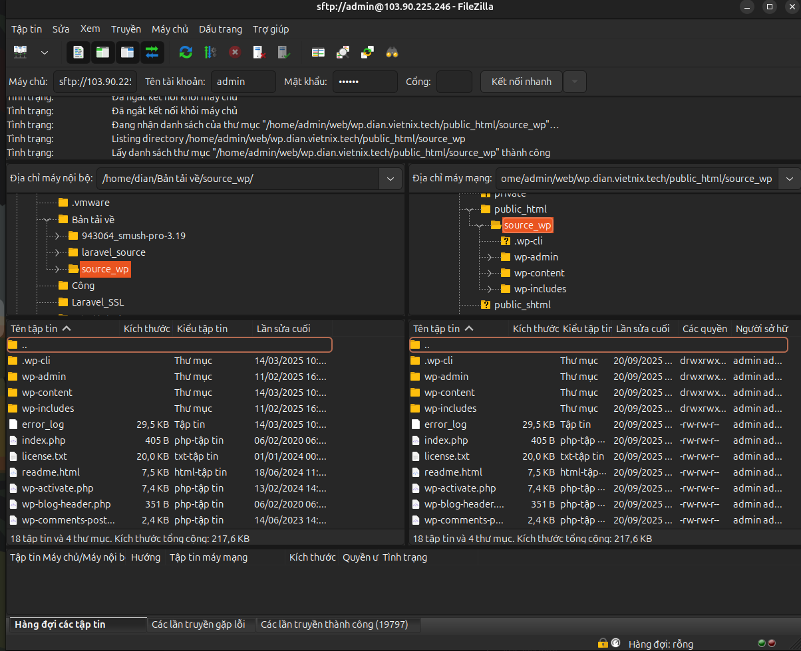
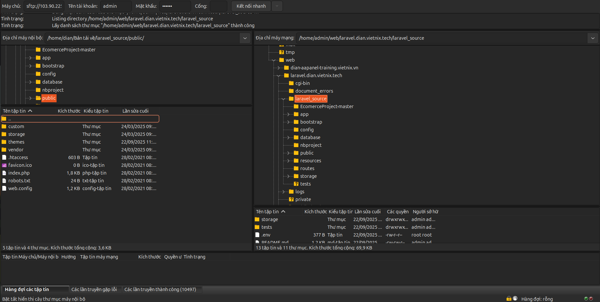

- Cấu hình wp-config.php và .env theo thông tin database vừa tạo.

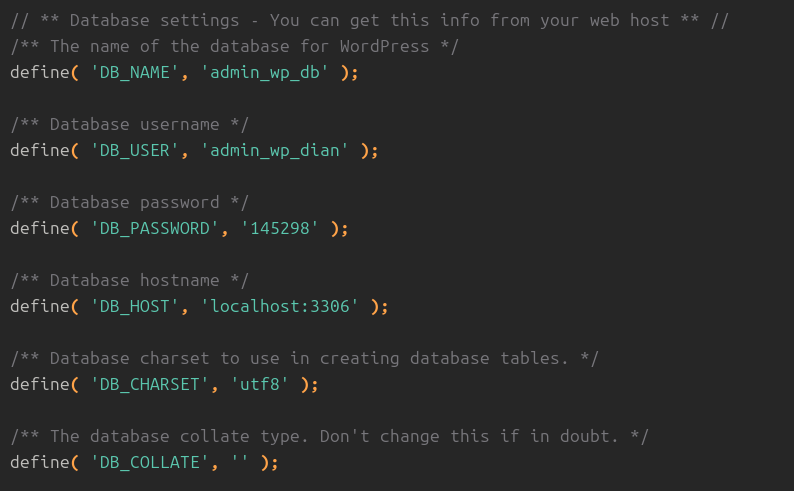

- Truy cập website để kiểm thử web.

