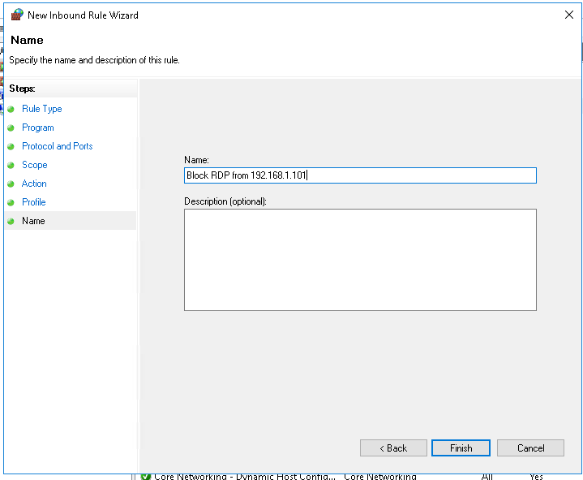
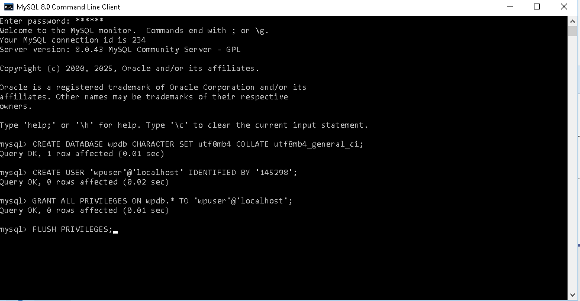
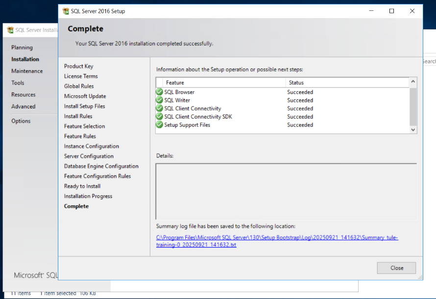

# Cấu hình Winfows Firewall
## Thực hiện allow port, allow ip trên window fw

## Thực hiện block port, block ip trên window fw
- Làm tương tự allow thay đổi sang block

## Thực hiện giới hạn port, giới hạn ip trên window fw chỉ cho phép ip chỉ định truy cập

# Thực hành cài đặt
## Webserver IIS, trên Webserver IIS+ Cài đặt website Wordpress mặc định+ Cài đặt SSL
- Vào server manager, chọn add roles and features

- Chọn các server roles và features cần thiết

- Tạo website mới  

- Download source code wordpress về và unzip vào thư mục của wp

- Download, unzip mysql và cài đặt mysql

-  Tạo database và user cho wp

- Chỉnh sửa file config:

- Add SSL cho website:

- Mặc định, IIS thường ưu tiên các file như index.html hoặc default.aspx khi người dùng truy cập vào thư mục gốc mà không chỉ định file cụ thể. Tuy nhiên, với WordPress thì file khởi đầu quan trọng lại là index.php. Vì vậy, ta phải vào mục Default Document trong IIS Manager và thêm index.php vào danh sách, đồng thời sắp xếp nó ở vị trí ưu tiên cao nhất.

- Add Handler Mapping

- Truy cập vào website để kiểm tra đã hoạt động chưa

## Cài đặt SQL Server: 2016
- Truy cập đường dẫn này "Link download: https://software.vietnix.tech/datastore/sources/SQL_Server/sql2016/" và tải về file .iso:
  
- Sau đó Mount và set up SQL Server:
  
