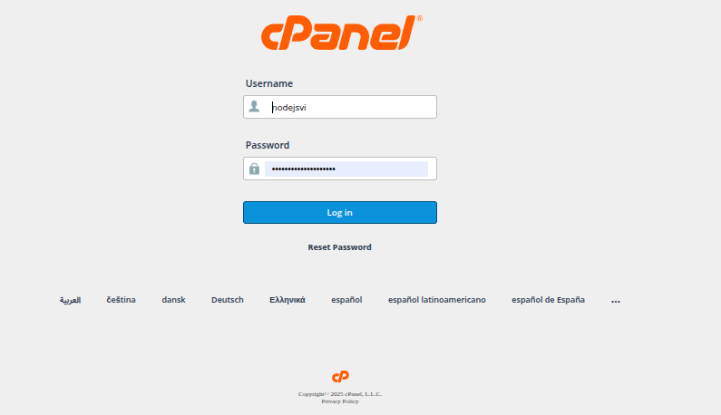
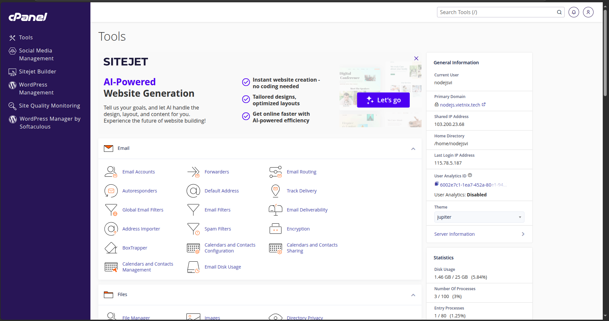

# TOPIC 5

## Tìm hiểu và làm quen với giao diện CPanel

### CPanel là gì ?
  **cPanel** là một hệ thống quản trị web hosting mạnh mẽ, được xây dựng trên nền tảng Linux, cung cấp giao diện đồ họa trực quan và dễ sử dụng. Giao diện này được thiết kế đơn giản, linh hoạt, cho phép người dùng dễ dàng quản lý mọi khía cạnh của website và hosting.
  - **cPanel** hoạt động dựa trên một hệ thống phân cấp ba lớp: Nhà cung cấp dịch vụ hosting (Hosting Company), Đại lý bán lại (Reseller) và Người dùng cuối (End User). Cả Hosting Company và Reseller đều sử dụng giao diện Web Host Manager (WHM) để quản lý máy chủ, trong khi End User tương tác trực tiếp với giao diện cPanel.

### Tính năng cơ bản của cPanel:
-  Dashboard (Trang chính)
    - Thống kê tài nguyên: CPU, RAM, dung lượng ổ cứng, băng thông.
    - Các shortcut: File Manager, Email, Domain, SSL/TLS, Databases.
  
-  Quản lý tập tin
    - File Manager (Trình quản lý file): Cho phép người dùng truy cập, tạo, chỉnh sửa và xóa file trực tiếp trên hosting mà không cần sử dụng FTP.
    - Disk Usage (Theo dõi dung lượng ổ cứng): Cung cấp giao diện trực quan để giám sát và quản lý việc sử dụng dung lượng ổ cứng.
    - Backup and Backup Wizard (Backup và restore dữ liệu): Hỗ trợ sao lưu dữ liệu trên web hosting một cách dễ dàng, giúp khôi phục dữ liệu khi cần thiết.
    - Images (Hình ảnh): Tính năng này cho phép người dùng thay đổi kích thước, chuyển đổi định dạng và xem hình ảnh ngay trên cPanel.
    - Web Disk: Cho phép người dùng quản lý không gian lưu trữ như trên máy tính cá nhân, hỗ trợ chỉnh sửa, di chuyển, upload và download file một cách thuận tiện.
    - Directory Privacy (Thư mục bảo mật): Tăng cường bảo mật bằng cách đặt mật khẩu cho thư mục.
    - FTP Accounts (Tài khoản FTP): Hỗ trợ quản lý và thêm tài khoản FTP dễ dàng.

-  Quản lý cơ sở dữ liệu
    - phpMyAdmin: Giao diện web phổ biến, giúp quản trị cơ sở dữ liệu MySQL một cách trực quan và dễ dàng.
    - Remote Database Access: Cho phép kết nối và truy cập đến cơ sở dữ liệu từ xa, hỗ trợ các ứng dụng trên máy chủ khác sử dụng chung dữ liệu.
    - Manage My Databases: Cung cấp giao diện quản lý toàn diện các cơ sở dữ liệu trên website, bao gồm việc tạo, chỉnh sửa và quản lý tài khoản người dùng cơ sở dữ liệu.
    - Database Wizard: Hỗ trợ tạo và quản lý cơ sở dữ liệu trên cPanel nhanh chóng.
    
-  Quản lý tên miền
    - Site Publisher (Trình xuất bản trang web): Cho phép tạo trang web đơn giản hoặc trang chờ trong khi phát triển website chính.
    - Redirects (Chuyển hướng): Dễ dàng thiết lập chuyển hướng từ URL này sang URL khác.
    - Zone Editor: Kiểm soát và quản lý các bản ghi DNS, chẳng hạn như A record, CNAME record,…
    - Sitejet Builder (Trình tạo trang web): Tạo trang web đơn giản bằng giao diện kéo thả trực quan mà không cần kiến thức lập trình.
    - Dynamic DNS: Hỗ trợ quản lý tên miền với địa chỉ IP động.
    - WordPress Managment (WP Toolkit): Cung cấp các công cụ để cài đặt, cập nhật và quản lý theme, plugin cũng như website WordPress.
    - Domains: Cho phép tạo và quản lý các tên miền phụ (subdomain), tên miền alias và tên miền addon.

  -  Tính năng email
    - Email Accounts (Quản lý tài khoản email): Dễ dàng thiết lập, quản lý và kiểm soát các tài khoản email.
    - Autoresponders (Trả lời tự động): Gửi phản hồi tự động đến các email nhận được, hữu ích cho việc thông báo vắng mặt.
    - Track Delivery (Theo dõi hành trình email): Giám sát quá trình gửi email.

  -  Tính năng bảo mật
    - SSH Access (Truy cập SSH): Kết nối an toàn đến máy chủ thông qua dòng lệnh.
    - IP Blocker (Trình chặn IP): Chặn truy cập từ các địa chỉ IP cụ thể.
    - Two-Factor Authentication (Xác thực hai yếu tố): Tăng cường bảo mật đăng nhập bằng cách yêu cầu xác minh hai lớp.
    - SSL/TLS: Quản lý, cài đặt chứng chỉ SSL/TLS để mã hóa kết nối và bảo vệ dữ liệu truyền tải.
    - Security Policy (Chính sách bảo mật): Thiết lập các câu hỏi xác minh cho các truy cập từ IP không xác định.
    - SSL/TLS Status: Kiểm tra trạng thái của chứng chỉ SSL/TLS hiện tại.
 -  Các ứng dụng phần mềm
    - WordPress Manager by Softaculous: Cài đặt, quản lý và cập nhật WordPress một cách dễ dàng từ giao diện cPanel.
    - Site Software (Phần mềm trang web): Cài đặt các ứng dụng web phổ biến như phần mềm thương mại điện tử và diễn đàn.
    - Optimize Website (Tối ưu hóa trang web): Tối ưu thời gian phản hồi của Web Server Apache để cải thiện tốc độ tải trang.
    - Application Manager: Đăng ký, quản lý và triển khai các ứng dụng tùy chỉnh thông qua Phusion Passenger.
    - MultiPHP Manager (Trình quản lý MultiPHP): Lựa chọn và áp dụng nhiều phiên bản PHP khác nhau cho từng website cụ thể.
    - Softaculous Apps Installer: Cài đặt, quản lý các ứng dụng trên Softaculous.
    - Setup Node.js App: Triển khai và quản lý ứng dụng Node.js (yêu cầu kiến thức chuyên môn).
    - Select PHP Version: Tùy chọn phiên bản PHP chạy song song.
    - X-Ray App: Ứng dụng theo dõi và phân tích tiến trình PHP theo thời gian thực để khắc phục sự cố và tối ưu hiệu suất.

## Move dữ liệu từ VPS sang CPanel
 - Truy cập cPanel và đăng nhập tài khoản:
   
   - Giao diện trang chủ của cPanel:
     

